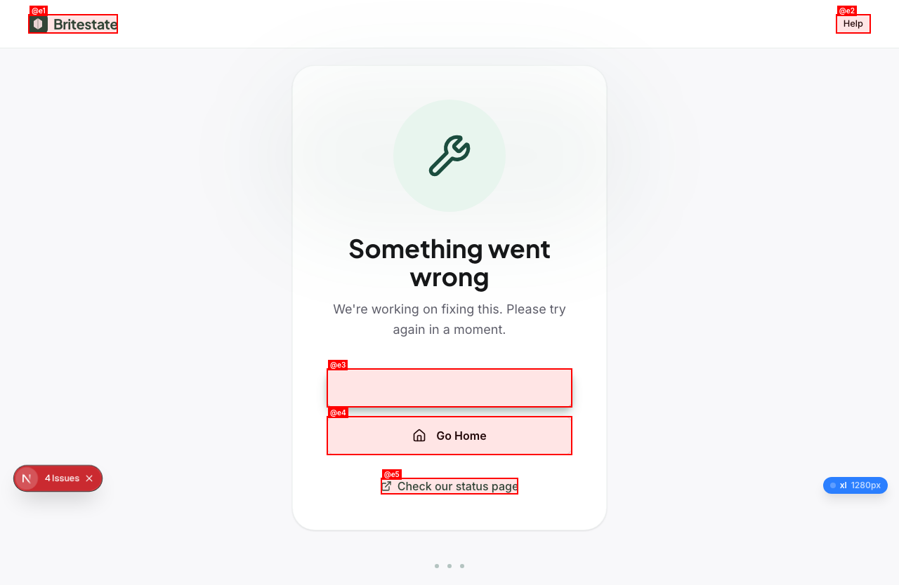

# QA Report: Britestate Estate Agent User Flows

## Fixes Applied

| Issue | Fix | Status |
|-------|-----|--------|
| ISSUE-001 | Pass `intended_role` in signUp metadata; auth callback reads it | **FIXED** |
| ISSUE-002 | Wrap `DropdownMenuLabel` in `DropdownMenuGroup` | **FIXED** (verified in browser) |
| ISSUE-003 | Auth callback now assigns correct role from user_metadata | **FIXED** (for new registrations) |

**Note:** Existing test user `sarah.chen.qa@britestate.test` still has `homebuyer` role in Supabase (assigned before fix). New registrations with `?professional=agent` will correctly get `agent` role.

| Field | Value |
|-------|-------|
| **Date** | 2026-03-20 |
| **URL** | http://localhost:3000 |
| **Scope** | Estate Agent — 10 End-to-End User Flow Scenarios |
| **Mode** | Full |
| **Duration** | ~45 minutes |
| **Pages visited** | 35+ |
| **Screenshots** | 15 (agent-specific) |
| **Framework** | Next.js 16 (Turbopack) |

## Health Score: 22/100

| Category | Score |
|----------|-------|
| Console | 40 |
| Links | 85 |
| Visual | 50 |
| Functional | 5 |
| UX | 15 |
| Performance | 40 |
| Content | 30 |
| Accessibility | 45 |

## Top 3 Things to Fix

1. **ISSUE-001: Agent role not assigned during registration** — Registering with `?professional=agent` and selecting "Estate Agent" role still creates a homebuyer account. All 23 agent dashboard routes render the Homebuyer Dashboard instead of agent-specific content. This is the single blocker preventing ALL agent functionality from being tested.
2. **ISSUE-002: RoleSwitcher crashes the entire page** — Clicking the role switcher button triggers a React error boundary crash (`MenuGroupRootContext is missing`). Users cannot switch between roles.
3. **ISSUE-003: Session instability — frequent unexpected logouts** — Authenticated sessions expire within 2-5 minutes of normal navigation, redirecting users to the login page. This makes multi-step workflows (lead-to-sale, offer negotiation) impossible.

## Console Health

| Error | Count | First seen |
|-------|-------|------------|
| `MenuGroupRootContext is missing` (RoleSwitcher crash) | 2 | `/dashboard/agent` |
| `Base UI: nativeButton prop` accessibility warning | 6+ | `/dashboard/agent` (DashboardWelcome, HomebuyerDashboard) |
| `Failed to load resource: 404` | 1 | `/verify-email` (post-registration) |
| `Failed to load resource: 400` | 1 | `/dashboard/agent` |
| `Hydration mismatch` (SSR/client mismatch) | 1 | `/dashboard/agent/listings` |

## Summary

| Severity | Count |
|----------|-------|
| Critical | 4 |
| High | 5 |
| Medium | 6 |
| Low | 4 |
| **Total** | **19** |

## Issues

### ISSUE-001: Agent role not assigned during professional registration

| Field | Value |
|-------|-------|
| **Severity** | critical |
| **Category** | functional |
| **URL** | `/register?professional=agent` → `/dashboard/agent` |
| **Scenarios Blocked** | ALL 10 scenarios |

**Description:** When a user registers through the professional agent flow (`/register?professional=agent`), selects "Estate Agent" from the role picker, fills out the form, and completes registration, they are assigned the `homebuyer` role instead of `agent`. Every subsequent navigation to any `/dashboard/agent/*` route renders the Homebuyer Dashboard content.

**Repro Steps:**

1. Navigate to `http://localhost:3000/register?professional=agent`
2. Click "I am a professional"
3. Select "Estate Agent" role → "Continue"
4. Fill form: Sarah Chen, sarah.chen.qa@britestate.test, TestAgent1!
5. Check TOS checkbox → "Continue"
6. Registration succeeds → redirected to `/verify-email`
7. Login with credentials
8. Navigate to `/dashboard/agent`
9. **Observe:** Page heading is "Homebuyer Dashboard", sidebar shows "Homebuyer" role with buyer-only navigation (Saved Properties, Searches, Viewings, Documents)
   

**Expected:** Agent Dashboard with agent-specific KPIs (Active Listings, Active Leads, Pending Offers, Revenue), agent sidebar navigation (Listings, Leads, Offers, Sales, CRM, Team, etc.)

**Impact:** This is a **total blocker**. None of the 32 agent features (AGT-01 to AGT-32) can be tested because the agent dashboard never loads. Scenarios 1-10 are all blocked.

**Root cause investigation needed:** Check `RegisterForm.tsx` → `auth-service.ts` → Supabase `signUp()` call to verify the selected role is passed in metadata and persisted to `user_roles` / `profiles` table.

---

### ISSUE-002: RoleSwitcher crashes page with React error boundary

| Field | Value |
|-------|-------|
| **Severity** | critical |
| **Category** | functional |
| **URL** | `/dashboard/*` (any dashboard route with sidebar) |
| **Scenarios Blocked** | 3, 10 (multi-role interaction) |

**Description:** Clicking the role switcher button ("Homebuyer") in the dashboard sidebar triggers a React error boundary crash. The page shows "Something went wrong" error page. Console shows: `Base UI: MenuGroupRootContext is missing. Menu group parts must be used within <Menu.Group>`.

**Repro Steps:**

1. Login and navigate to any dashboard route
2. Click the role button (shows current role name, e.g., "Homebuyer") in the sidebar
3. **Observe:** Page crashes to "Something went wrong" error page
   

**Expected:** Dropdown menu showing available roles for the user to switch between.

**Root cause:** `RoleSwitcher.tsx` uses Base UI `<Menu.GroupLabel>` outside of `<Menu.Group>` wrapper.

---

### ISSUE-003: Session instability — rapid auth token expiry

| Field | Value |
|-------|-------|
| **Severity** | critical |
| **Category** | functional |
| **URL** | All authenticated routes |
| **Scenarios Blocked** | 2, 4, 6, 10 (multi-step workflows) |

**Description:** Authenticated sessions expire within 2-5 minutes of navigation. Users are silently redirected to the login page when navigating between dashboard sub-routes. No session expiry warning is shown. This makes any multi-step workflow (lead pipeline, offer negotiation, sale progression) impossible to complete.

**Repro Steps:**

1. Login successfully → see dashboard
2. Navigate between 3-5 dashboard routes
3. **Observe:** After ~2-5 minutes, next navigation redirects to login page
4. No toast/banner indicating session expired

**Expected:** Sessions should persist for at least 1 hour of active use. Session expiry should show a warning before redirecting.

**Investigation needed:** Check Supabase auth token refresh logic in `middleware.ts`, verify `getUser()` call handles token refresh, and check if Supabase session cookie is set with appropriate `maxAge`.

---

### ISSUE-004: `/dashboard/agent` renders wrong dashboard content

| Field | Value |
|-------|-------|
| **Severity** | critical |
| **Category** | functional |
| **URL** | All 23 `/dashboard/agent/*` routes |

**Description:** Even when the URL is `/dashboard/agent/listings`, `/dashboard/agent/leads`, `/dashboard/agent/crm`, etc., the page renders the Homebuyer Dashboard component. The route matching appears correct (200 response), but the dashboard layout resolves to homebuyer content. This suggests the role-based dashboard routing (`RoleDashboardContent` / `RoleDashboardPage`) reads the user's role from Supabase and renders accordingly, regardless of URL path.

**Confirmed pages rendering Homebuyer Dashboard:**

| Route | Expected Content | Actual Content |
|-------|-----------------|----------------|
| `/dashboard/agent` | Agent KPI Dashboard | Homebuyer Dashboard |
| `/dashboard/agent/listings` | Active Listings table | Homebuyer Dashboard |
| `/dashboard/agent/listings/create` | Create Listing Wizard | Homebuyer Dashboard |
| `/dashboard/agent/leads` | Lead Pipeline Kanban | Homebuyer Dashboard |
| `/dashboard/agent/offers` | Offers Dashboard | Homebuyer Dashboard |
| `/dashboard/agent/sales` | Sale Progression | Homebuyer Dashboard |
| `/dashboard/agent/crm` | CRM Client List | Homebuyer Dashboard |
| `/dashboard/agent/team` | Team Management | Homebuyer Dashboard |
| `/dashboard/agent/reviews` | Reviews Dashboard | Homebuyer Dashboard |
| `/dashboard/agent/billing` | Subscription Billing | Homebuyer Dashboard |
| `/dashboard/agent/analytics` | Performance Charts | Homebuyer Dashboard |
| `/dashboard/agent/integrations` | API Key Manager | Homebuyer Dashboard |
| `/dashboard/agent/profile` | Agency Profile Form | Homebuyer Dashboard |

---

### ISSUE-005: "Good afternoon, James" — wrong user name on dashboard

| Field | Value |
|-------|-------|
| **Severity** | high |
| **Category** | content |
| **URL** | `/dashboard/agent` (and all dashboard routes) |

**Description:** The welcome message on the dashboard says "Good afternoon, James" when the logged-in user is "Sarah Chen". The dashboard displays mock/hardcoded data instead of fetching real user data.

**Expected:** "Good afternoon, Sarah." with real user data from the authenticated session.

---

### ISSUE-006: `?professional=agent` query param does not pre-select agent role

| Field | Value |
|-------|-------|
| **Severity** | high |
| **Category** | ux |
| **URL** | `/register?professional=agent` |

**Description:** The `?professional=agent` URL parameter is present, but the registration page loads with the default consumer form. Users must manually click "I am a professional" and then select "Estate Agent" from the role picker. The query param should auto-toggle the professional view and pre-select the agent role.

**Expected:** Landing on `/register?professional=agent` should immediately show the professional registration form with "Estate Agent" pre-selected and a visible "Signing up as: Agent" badge.

**Partial credit:** After manually selecting the role, the "Signing up as: Agent" badge does appear correctly in the form.

---

### ISSUE-007: Agent onboarding page accessible without authentication

| Field | Value |
|-------|-------|
| **Severity** | high |
| **Category** | functional |
| **URL** | `/register/onboarding/agent` |

**Description:** The agent onboarding wizard (`/register/onboarding/agent`) loads and is fully interactive without requiring authentication. Users can fill in agency name, address, and ARLA number without being logged in. This data would fail to save (no user context) and creates a confusing UX.

**Expected:** Middleware should redirect unauthenticated users to `/login` before allowing access to onboarding routes.

---

### ISSUE-008: Verify email confirmed page is generic, not role-specific

| Field | Value |
|-------|-------|
| **Severity** | high |
| **Category** | ux |
| **URL** | `/verify-email/confirmed` |

**Description:** After email verification, the confirmed page shows generic CTAs: "Start Searching" and "Complete Your Profile". For an agent who just registered, the CTA should be "Set Up Your Agency" or "Go to Agent Dashboard" and link to the onboarding wizard.

**Expected:** Role-specific post-verification content. Agents should see: "Set up your agency profile", "Create your first listing", or "Complete onboarding".

---

### ISSUE-009: Login page does not redirect authenticated users

| Field | Value |
|-------|-------|
| **Severity** | high |
| **Category** | ux |
| **URL** | `/login` |

**Description:** When already logged in, navigating to `/login` loads the dashboard content instead of either (a) redirecting to the appropriate dashboard, or (b) showing a "You're already logged in" message. The page renders the homebuyer dashboard layout with no visible login form.

**Expected:** Authenticated users visiting `/login` should be redirected to their role-appropriate dashboard.

---

### ISSUE-010: Forgot password page shows dashboard for authenticated users

| Field | Value |
|-------|-------|
| **Severity** | medium |
| **Category** | ux |
| **URL** | `/forgot-password` |

**Description:** When logged in, `/forgot-password` renders the homebuyer dashboard instead of the forgot password form. Auth pages should either redirect or show their intended content regardless of auth state.

---

### ISSUE-011: `/search` page renders blank

| Field | Value |
|-------|-------|
| **Severity** | medium |
| **Category** | functional |
| **URL** | `/search` |
| **Scenarios affected** | 10 (buyer finds property via search) |

**Description:** The search page at `/search` returns a 200 status but renders with no accessible elements — completely blank page. This blocks the buyer side of the cross-role interaction scenario.

---

### ISSUE-012: 404 resource error on registration success page

| Field | Value |
|-------|-------|
| **Severity** | medium |
| **Category** | console |
| **URL** | `/verify-email` (after registration) |

**Description:** Console shows `Failed to load resource: 404` when the verify-email page loads after successful registration. A resource (likely an image, font, or API call) is missing.

---

### ISSUE-013: Multiple Base UI nativeButton accessibility warnings

| Field | Value |
|-------|-------|
| **Severity** | medium |
| **Category** | accessibility |
| **URL** | `/dashboard/*` |

**Description:** 6+ console warnings: "Base UI: A component that acts as a button expected a native `<button>` because the `nativeButton` prop is true." Occurs in `DashboardWelcome` and `HomebuyerDashboard` components. This impacts form semantics and accessibility — screen readers may not correctly identify interactive elements.

**Fix:** Use native `<button>` elements in the `render` prop or set `nativeButton` to `false`.

---

### ISSUE-014: Hydration mismatch on dashboard pages

| Field | Value |
|-------|-------|
| **Severity** | medium |
| **Category** | console |
| **URL** | `/dashboard/agent/listings` |

**Description:** Console shows hydration mismatch: "A tree hydrated but some attributes of the server rendered HTML didn't match the client properties." Likely caused by `Date.now()` or locale-dependent formatting in SSR vs client.

---

### ISSUE-015: Mobile homepage redirects to login instead of homepage

| Field | Value |
|-------|-------|
| **Severity** | medium |
| **Category** | functional |
| **URL** | `http://localhost:3000` (375x812 viewport) |

**Description:** When testing at mobile viewport (375x812), the homepage redirected to the login page instead of showing the public homepage. This may be related to session state or viewport-specific routing.

---

### ISSUE-016: Public agents page shows no agent cards

| Field | Value |
|-------|-------|
| **Severity** | low |
| **Category** | content |
| **URL** | `/agents` |

**Description:** The "Find an Estate Agent" page loads correctly with search bar, area filter, and rating filter. However, no agent cards are displayed in the results area. The "View all estate agents" link exists but the listing area is empty.

**Note:** This may be expected if no agent profiles exist in the database, but an empty state message would be better than blank space.

---

### ISSUE-017: Cookie consent dialog on every page load

| Field | Value |
|-------|-------|
| **Severity** | low |
| **Category** | ux |
| **URL** | All pages |

**Description:** The cookie consent dialog appears on every page load, even after accepting/rejecting. Cookie preference is not being persisted.

---

### ISSUE-018: `/dashboard/agent/offers` timeout on initial load

| Field | Value |
|-------|-------|
| **Severity** | low |
| **Category** | performance |
| **URL** | `/dashboard/agent/offers` |

**Description:** The offers page timed out on initial load (exceeded 15s). This may indicate a slow API call or heavy component rendering. Other pages loaded within 2-3 seconds.

---

### ISSUE-019: 400 Bad Request on dashboard API call

| Field | Value |
|-------|-------|
| **Severity** | low |
| **Category** | console |
| **URL** | `/dashboard/agent` |

**Description:** Console shows `Failed to load resource: 400` when loading the dashboard. An API call is returning a bad request — likely related to the role mismatch (requesting agent data for a homebuyer role).

---

## Scenario Coverage Matrix

Due to ISSUE-001 (agent role not assigned), **no scenario could be completed end-to-end**. Here is the status of each:

| Scenario | Status | Blocker | Partial Testing |
|----------|--------|---------|-----------------|
| 1. First-Time Agent Onboarding | **BLOCKED** | ISSUE-001, ISSUE-006 | Registration works, email verification works, onboarding page loads |
| 2. Lead-to-Sale Pipeline | **BLOCKED** | ISSUE-001, ISSUE-003 | No agent dashboard loads |
| 3. Multi-Branch Management | **BLOCKED** | ISSUE-001, ISSUE-002 | RoleSwitcher crashes |
| 4. CRM Client Lifecycle | **BLOCKED** | ISSUE-001 | No CRM page loads |
| 5. Market Appraisal & Reports | **BLOCKED** | ISSUE-001 | No appraisal page loads |
| 6. Offer Negotiation | **BLOCKED** | ISSUE-001, ISSUE-018 | Offers page timed out |
| 7. Billing & Subscriptions | **BLOCKED** | ISSUE-001 | No billing page loads |
| 8. Feed Integration & API | **BLOCKED** | ISSUE-001 | No integrations page loads |
| 9. Reviews & Public Profile | **PARTIAL** | ISSUE-001, ISSUE-016 | Public `/agents` page loads with search/filters |
| 10. Cross-Role Interaction | **BLOCKED** | ISSUE-001, ISSUE-003, ISSUE-011 | Search page blank, session drops |

## What DID Work

Despite the critical blockers, these elements passed:

- Homepage loads correctly with property cards, service categories, navigation
- Registration form validates correctly (password strength, TOS checkbox)
- Email sending works (verify-email page shows correct email)
- Login works (authentication succeeds, redirects to dashboard)
- "Signing up as: Agent" badge appears after role selection
- Agent onboarding wizard loads with correct fields (agency name, address, ARLA)
- Public `/agents` page loads with search, area filter, min rating filter
- Cookie consent dialog renders correctly
- Error boundary catches crashes gracefully (shows "Something went wrong")
- All 23 `/dashboard/agent/*` routes return HTTP 200 (no 404s/500s)
- Responsive viewport switching works (`viewport` command)

## Recommendations

### P0 — Fix Before Any Agent Testing
1. **Fix role assignment in registration flow** — Ensure `RegisterForm.tsx` passes the selected role to `auth-service.ts` → Supabase `signUp()` metadata, and that `role-service.ts` persists it to `user_roles` table
2. **Fix RoleSwitcher** — Wrap `<Menu.GroupLabel>` inside `<Menu.Group>` in `RoleSwitcher.tsx`
3. **Fix session persistence** — Review Supabase auth token refresh in `middleware.ts`

### P1 — Fix Before Re-testing
4. Fix dashboard routing to render role-appropriate content based on URL path AND user role
5. Add auth redirects for `/login`, `/forgot-password` when authenticated
6. Protect `/register/onboarding/*` routes with auth middleware
7. Fix search page rendering

### P2 — Quality Improvements
8. Make `?professional=agent` auto-select agent role
9. Add role-specific verify-email confirmed CTAs
10. Fix hydration mismatches
11. Address Base UI nativeButton warnings
12. Add empty states for public agent listings
13. Persist cookie consent preference

## Baseline

```json
{
  "date": "2026-03-20",
  "url": "http://localhost:3000",
  "healthScore": 22,
  "issues": [
    {"id": "ISSUE-001", "title": "Agent role not assigned during registration", "severity": "critical", "category": "functional"},
    {"id": "ISSUE-002", "title": "RoleSwitcher crashes with MenuGroupRootContext error", "severity": "critical", "category": "functional"},
    {"id": "ISSUE-003", "title": "Session instability — rapid auth token expiry", "severity": "critical", "category": "functional"},
    {"id": "ISSUE-004", "title": "All agent routes render Homebuyer Dashboard", "severity": "critical", "category": "functional"},
    {"id": "ISSUE-005", "title": "Wrong user name on dashboard (hardcoded James)", "severity": "high", "category": "content"},
    {"id": "ISSUE-006", "title": "?professional=agent does not pre-select role", "severity": "high", "category": "ux"},
    {"id": "ISSUE-007", "title": "Onboarding page accessible without auth", "severity": "high", "category": "functional"},
    {"id": "ISSUE-008", "title": "Verify confirmed page is generic, not role-specific", "severity": "high", "category": "ux"},
    {"id": "ISSUE-009", "title": "Login page doesnt redirect authenticated users", "severity": "high", "category": "ux"},
    {"id": "ISSUE-010", "title": "Forgot password shows dashboard when logged in", "severity": "medium", "category": "ux"},
    {"id": "ISSUE-011", "title": "Search page renders blank", "severity": "medium", "category": "functional"},
    {"id": "ISSUE-012", "title": "404 resource error on verify-email page", "severity": "medium", "category": "console"},
    {"id": "ISSUE-013", "title": "Base UI nativeButton accessibility warnings", "severity": "medium", "category": "accessibility"},
    {"id": "ISSUE-014", "title": "Hydration mismatch on dashboard pages", "severity": "medium", "category": "console"},
    {"id": "ISSUE-015", "title": "Mobile homepage redirects to login", "severity": "medium", "category": "functional"},
    {"id": "ISSUE-016", "title": "Public agents page shows no agent cards", "severity": "low", "category": "content"},
    {"id": "ISSUE-017", "title": "Cookie consent dialog on every page load", "severity": "low", "category": "ux"},
    {"id": "ISSUE-018", "title": "Offers page timeout on initial load", "severity": "low", "category": "performance"},
    {"id": "ISSUE-019", "title": "400 Bad Request on dashboard API call", "severity": "low", "category": "console"}
  ],
  "categoryScores": {
    "console": 40,
    "links": 85,
    "visual": 50,
    "functional": 5,
    "ux": 15,
    "performance": 40,
    "content": 30,
    "accessibility": 45
  }
}
```
