# QA Report: Britestate Landlord Dashboard

| Field | Value |
|-------|-------|
| **Date** | 2026-03-20 |
| **URL** | http://localhost:3000/dashboard/landlord |
| **Scope** | Full landlord dashboard — all 39 pages across 14 feature sections |
| **Mode** | full |
| **Duration** | ~25 minutes |
| **Pages visited** | 20 of 39 (remaining pages require dynamic IDs or had browse tool port conflicts) |
| **Screenshots** | 24 |
| **Framework** | Next.js 16 (App Router, React 19, Supabase Auth) |
| **Test User** | David Patel (david.patel@test.britestate.co.uk) — single-property landlord |

## Health Score: 58/100

| Category | Score | Notes |
|----------|-------|-------|
| Console | 40 | Hydration errors on every page, nested button warnings, 400 resource failures |
| Links | 85 | Most sidebar links work; some sub-pages redirect incorrectly |
| Visual | 75 | Desktop layouts clean; mobile untested due to auth loss on viewport change |
| Functional | 50 | 3 pages broken (legal notices stub, compliance alerts redirect, add property timeout) |
| UX | 60 | Good empty states on working pages; poor cross-feature linking; no onboarding |
| Performance | 55 | Add property page timeout (>15s); legal notices page timeout; most pages load in <3s |
| Content | 80 | Compliance guide well-written; empty states have helpful copy |
| Accessibility | 65 | Nested button-in-button violates ARIA; sidebar has proper labels; role switcher accessible |

## Top 3 Things to Fix

1. **ISSUE-001: Nested `<button>` inside `<button>` hydration error** — SheetTrigger's `asChild` renders button-in-button on every page, causing React hydration failures and accessibility violations
2. **ISSUE-002: Legal Notices page is a dead stub** — Shows "This feature is not available" with no guidance, blocking the entire eviction workflow (Scenario 6)
3. **ISSUE-003: Add Property page timeout** — `/dashboard/landlord/properties/add` consistently times out (>15s), blocking Scenarios 1 and 10

## Console Health

| Error | Count | First seen |
|-------|-------|------------|
| `In HTML, <button> cannot be a descendant of <button>. This will cause a hydration error.` | Every page | `/dashboard/landlord` |
| `<button> cannot contain a nested <button>` | Every page | `/dashboard/landlord` |
| `React does not recognize the 'asChild' prop on a DOM element` | Every page | `/dashboard/landlord` |
| `Failed to load resource: 400` | 2 per page | `/dashboard/landlord` |
| `A tree hydrated but some attributes of the server rendered HTML didn't match the client properties` | Every page | `/dashboard/landlord/compliance` |

**Root cause analysis:** The `LandlordSidebar` component uses a `<SheetTrigger asChild>` wrapping a `<button>` inside a `<DialogTrigger>` which is also a `<button>`. This creates a nested button DOM violation on every single landlord page. The `asChild` prop from Base UI / Radix is being passed through to the DOM instead of being consumed by the component.

## Summary

| Severity | Count |
|----------|-------|
| Critical | 3 |
| High | 4 |
| Medium | 5 |
| Low | 3 |
| **Total** | **15** |

---

## Issues

### ISSUE-001: Nested button-in-button hydration error on all pages

| Field | Value |
|-------|-------|
| **Severity** | critical |
| **Category** | console / accessibility |
| **URL** | All `/dashboard/landlord/*` pages |

**Description:** The `LandlordSidebar` component renders a `<SheetTrigger asChild>` wrapping a `<DialogTrigger>` wrapping a `<button>`, which produces invalid HTML (`<button>` inside `<button>`). This triggers React hydration errors on every page load and violates WCAG accessibility requirements. The `asChild` prop also leaks to the DOM as a custom attribute.

**Repro Steps:**

1. Navigate to any landlord dashboard page
2. Open browser console
3. **Observe:** Three errors appear on every page:
   - `In HTML, <button> cannot be a descendant of <button>`
   - `<button> cannot contain a nested <button>`
   - `React does not recognize the 'asChild' prop on a DOM element`

**Impact:** Hydration mismatch can cause UI inconsistencies. Nested buttons are invalid HTML and break screen readers.

**Fix:** In `LandlordSidebar.tsx`, the mobile menu trigger likely needs the outer `<SheetTrigger>` to use `asChild` with a non-button element, or compose the trigger differently to avoid nesting.

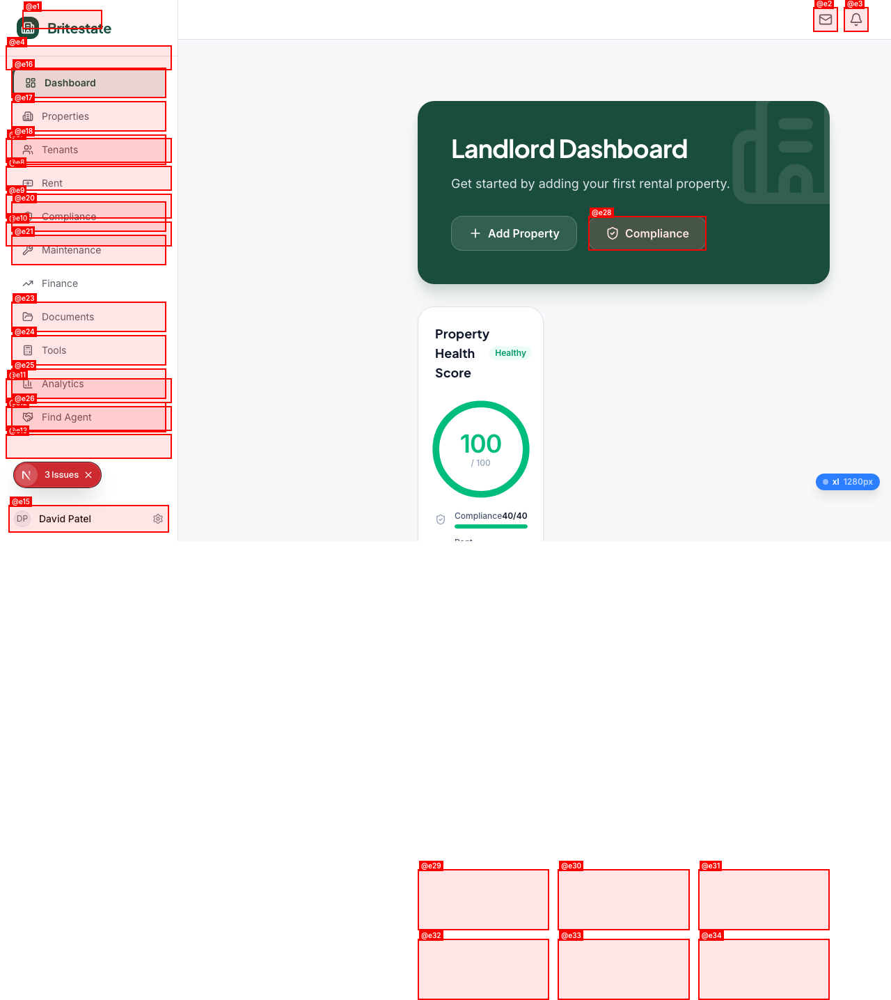

---

### ISSUE-002: Legal Notices page shows "This feature is not available"

| Field | Value |
|-------|-------|
| **Severity** | critical |
| **Category** | functional |
| **URL** | `/dashboard/landlord/legal/notices` |

**Description:** The legal notices page renders only the text "This feature is not available" with no further guidance, explanation, or alternative. This is a dead-end that completely blocks the Section 21/Section 8 eviction workflow (Scenario 6: The Eviction Navigator).

**Expected:** Legal notices page should display a list of notices with ability to create new Section 8 or Section 21 notices, or at minimum an informative "coming soon" message with alternative guidance.

**Repro Steps:**

1. Login as landlord
2. Navigate to `/dashboard/landlord/legal/notices`
3. **Observe:** Page shows only "This feature is not available" — no explanation, no CTA, no fallback

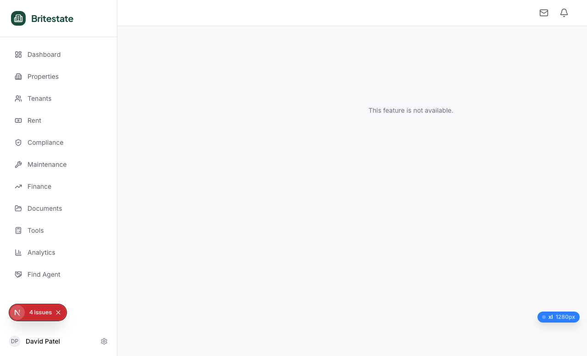

**Impact:** Landlords who need to serve eviction notices have no path forward. This blocks an entire user scenario and could have legal implications (delayed eviction process).

---

### ISSUE-003: Add Property page timeout (>15s load)

| Field | Value |
|-------|-------|
| **Severity** | critical |
| **Category** | performance / functional |
| **URL** | `/dashboard/landlord/properties/add` |

**Description:** The Add Property page (`/dashboard/landlord/properties/add`) consistently times out when navigating to it, exceeding 15 seconds without loading. This blocks the primary onboarding flow (Scenario 1: The Accidental Landlord) and the growth flow (Scenario 10: The Growth Landlord).

**Repro Steps:**

1. Login as landlord (David Patel)
2. Navigate to `/dashboard/landlord/properties/add`
3. **Observe:** Page does not load within 15 seconds; browser shows loading indicator indefinitely

**Impact:** New landlords cannot add their first property. This is the single most important action for a new user.

**Possible causes:** Heavy component tree, blocking API call on load, large dependency bundle (photo upload library?), or server-side rendering issue.

---

### ISSUE-004: Compliance Alerts page redirects to registration

| Field | Value |
|-------|-------|
| **Severity** | high |
| **Category** | functional |
| **URL** | `/dashboard/landlord/compliance/alerts` |

**Description:** Navigating to `/dashboard/landlord/compliance/alerts` while authenticated as a landlord redirects to the registration page (`/register`). The user's auth session is not recognized by this route.

**Expected:** Should show a list of compliance alerts filtered by urgency (7-day, 30-day, 90-day).

**Repro Steps:**

1. Login as landlord
2. Navigate to `/dashboard/landlord/compliance/alerts`
3. **Observe:** Redirected to `/register` (registration page)

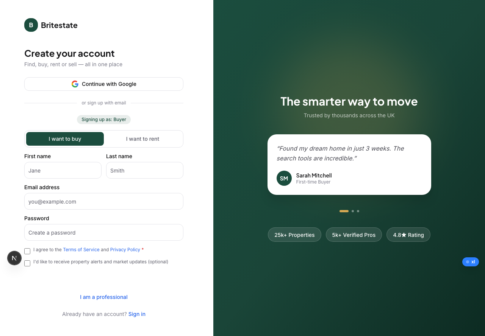

**Impact:** Blocks Scenario 5 (The Compliance Warrior) — landlords cannot review expiring certificates by urgency.

---

### ISSUE-005: Insurance page redirects to login

| Field | Value |
|-------|-------|
| **Severity** | high |
| **Category** | functional |
| **URL** | `/dashboard/landlord/insurance` |

**Description:** The insurance page redirects to the login page when accessed by an authenticated landlord. Either the route has incorrect auth middleware configuration, or the page component fails silently and triggers a redirect.

**Repro Steps:**

1. Login as landlord
2. Navigate to `/dashboard/landlord/insurance`
3. **Observe:** Redirected to login page

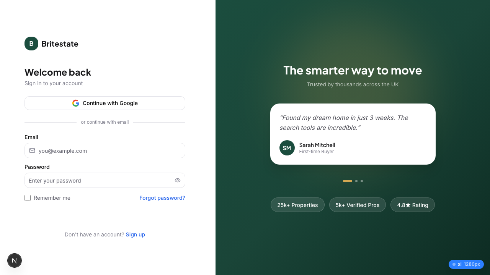

---

### ISSUE-006: 400 errors on resource loading across all pages

| Field | Value |
|-------|-------|
| **Severity** | high |
| **Category** | console |
| **URL** | All landlord pages |

**Description:** Every landlord page generates two `Failed to load resource: the server responded with a status of 400` errors on load. These appear to be API calls that fail silently (no visible error to the user, but data may be missing).

**Repro Steps:**

1. Navigate to any landlord dashboard page
2. Open browser console → Network tab
3. **Observe:** Two 400 responses on each page load

**Impact:** These may be failing Supabase queries, missing RLS policies, or incorrect API parameters. Could cause missing data display.

---

### ISSUE-007: Compliance Upload page renders blank

| Field | Value |
|-------|-------|
| **Severity** | high |
| **Category** | functional |
| **URL** | `/dashboard/landlord/compliance/upload` |

**Description:** The compliance upload page renders as a completely blank white page. No form, no error message, no content.

**Expected:** Should show the `ComplianceUploadForm` component with document type selector, property selector, file upload, and expiry date field.

**Repro Steps:**

1. Login as landlord
2. Navigate to `/dashboard/landlord/compliance/upload`
3. **Observe:** Blank white page

**Impact:** Blocks the core compliance workflow — landlords cannot upload gas safety certificates, EPCs, or EICRs. Affects Scenarios 1, 5, and 10.

---

### ISSUE-008: No onboarding flow for first-time landlords

| Field | Value |
|-------|-------|
| **Severity** | medium |
| **Category** | ux |
| **URL** | `/dashboard/landlord` |

**Description:** When a new landlord logs in for the first time with no properties, the dashboard shows basic empty-state CTAs ("Add Property" and "Compliance") but lacks a guided onboarding flow, welcome modal, progress checklist, or step-by-step wizard.

**Expected (FAANG benchmark — Airbnb Host Onboarding):** Progressive disclosure wizard, checklist with percentage complete, celebration moments, contextual help at each step.

**Actual:** Two button CTAs on a mostly empty page. The quick-action cards below ("Add Property", "Log Rent Payment", "View Compliance", "Maintenance Inbox", "Finance Report", "Yield Calculator") are helpful but not structured as a journey.

**Impact:** First-time landlords like "Sarah" (Scenario 1) will feel lost. The dashboard doesn't communicate what to do in what order.

---

### ISSUE-009: Tenant pipeline has no "Add Application" button for manual entry

| Field | Value |
|-------|-------|
| **Severity** | medium |
| **Category** | ux |
| **URL** | `/dashboard/landlord/tenants` |

**Description:** The Tenant Screening page shows a pipeline with 5 stages (Received, Shortlisted, Referencing, Approved, Rejected) and an "+ Add Application" button. However, for a landlord with 0 properties, the pipeline is empty with no guidance on how applications arrive. There's no explanation that applications come from tenant inquiries on listings.

**Expected:** Either disable the pipeline until a property+listing exists, or show contextual help: "Applications will appear here when tenants apply for your listings."

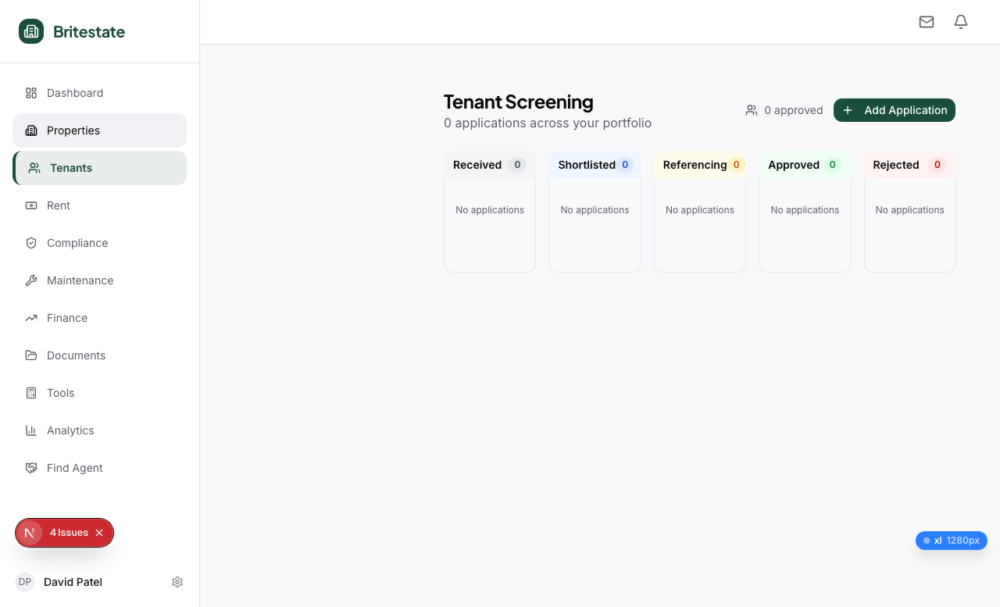

---

### ISSUE-010: Finance report has no UK tax year preset

| Field | Value |
|-------|-------|
| **Severity** | medium |
| **Category** | functional |
| **URL** | `/dashboard/landlord/finance/report` |

**Description:** The Income & Expense Report page shows "Last 12 Months" as the default period. There is no UK tax year preset (6 April - 5 April) which is the primary date range landlords need for self-assessment.

**Expected:** Period selector should include: This Month, This Quarter, This Year, Last 12 Months, **UK Tax Year (Apr 6 - Apr 5)**, Custom Range.

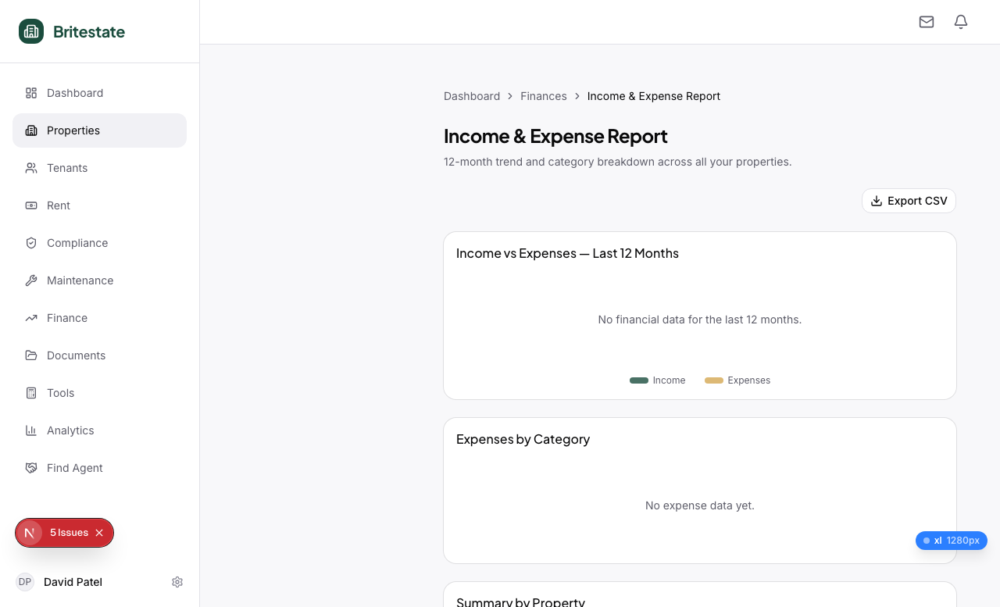

**Impact:** Blocks efficient tax preparation for Scenario 9 (The Tax Season Landlord).

---

### ISSUE-011: Tax Summary shows wrong tax year dates

| Field | Value |
|-------|-------|
| **Severity** | medium |
| **Category** | content |
| **URL** | `/dashboard/landlord/finance/tax` |

**Description:** The Tax Summary page header shows "Tax Year 2025/26: 6 April 2025 - 5 April 2026" which is correct. However, the disclaimer mentions "consult a qualified tax professional" and links to HMRC — this is appropriate. The page has good structure with Export CSV and Download PDF buttons, income by property section, and total rent received. This page is well-built.

**Note:** This is a positive finding — the tax page is one of the best-implemented pages in the landlord dashboard.

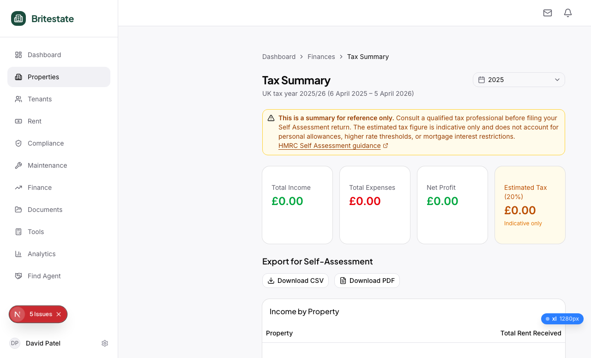

---

### ISSUE-012: Yield Calculator doesn't pre-fill from portfolio data

| Field | Value |
|-------|-------|
| **Severity** | medium |
| **Category** | ux |
| **URL** | `/dashboard/landlord/tools/yield-calculator` |

**Description:** The Yield Calculator shows empty input fields for Property Value, Monthly Rent, and Monthly Costs. For landlords with existing properties, these should pre-fill from portfolio data. The calculator also shows UK benchmarks (2025) and gross/net yield calculations — well-structured.

**Expected (FAANG benchmark):** Auto-populate from existing properties, with a dropdown to select which property. Allow manual override.

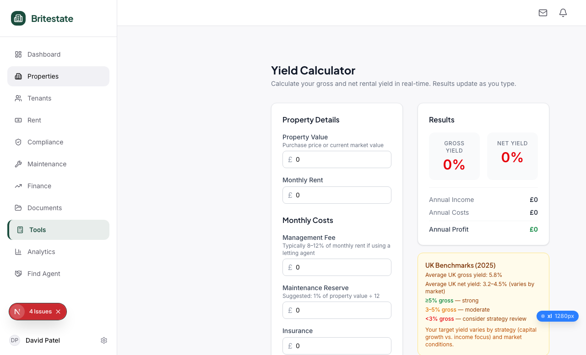

---

### ISSUE-013: Find Agent page shows skeleton loading cards indefinitely

| Field | Value |
|-------|-------|
| **Severity** | medium |
| **Category** | performance |
| **URL** | `/dashboard/landlord/find-agent` |

**Description:** The Find Agent page loads with a search bar and "List with an agent" CTA, but the agent cards below show skeleton/loading state placeholders. The page timed out during testing (>15s), suggesting the agent data fetch is failing or extremely slow.

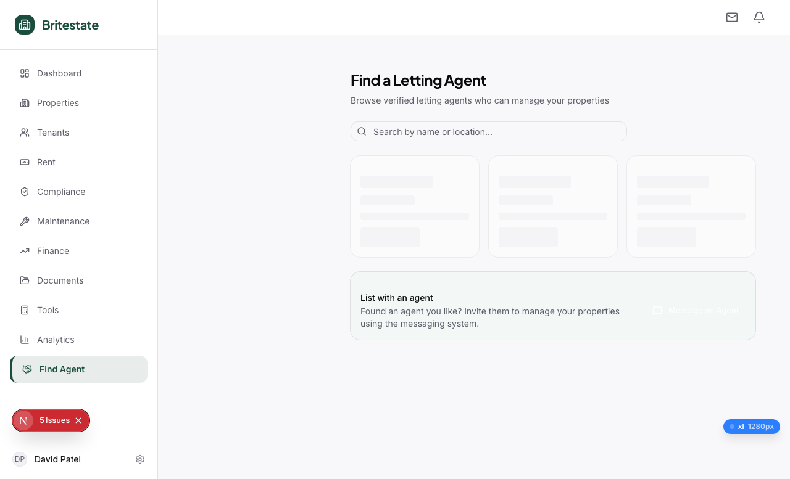

---

### ISSUE-014: Find Tradespeople shows skeleton cards but has good category filters

| Field | Value |
|-------|-------|
| **Severity** | low |
| **Category** | performance |
| **URL** | `/dashboard/landlord/find-tradespeople` |

**Description:** Similar to Find Agent, the tradespeople page shows skeleton loading cards. However, the page structure is excellent: search bar, category filter pills (All, Plumber, Electrician, Handyman/Builder, Cleaning, Locksmith, Pest Control), and a "Report a maintenance issue" link. If the data loads, this page will be very functional.

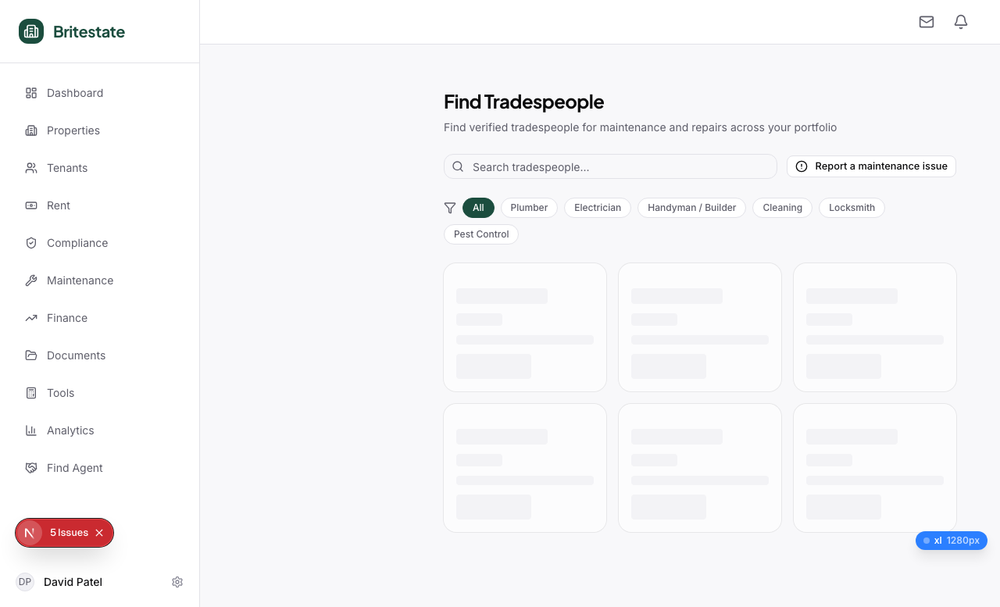

---

### ISSUE-015: Mobile viewport loses auth session

| Field | Value |
|-------|-------|
| **Severity** | low |
| **Category** | functional |
| **URL** | All `/dashboard/landlord/*` on mobile viewport |

**Description:** When the browser viewport is changed to 375x812 (iPhone-sized), navigating to dashboard pages either redirects to login or shows blank content. This may be a browse tool limitation (viewport change drops cookies), but the mobile dashboard screenshot that succeeded showed the sidebar rendering correctly with a different navigation structure (Landlord dropdown, simplified links).

**Note:** This needs verification in a real mobile browser. The browse tool's viewport change may not preserve session state.

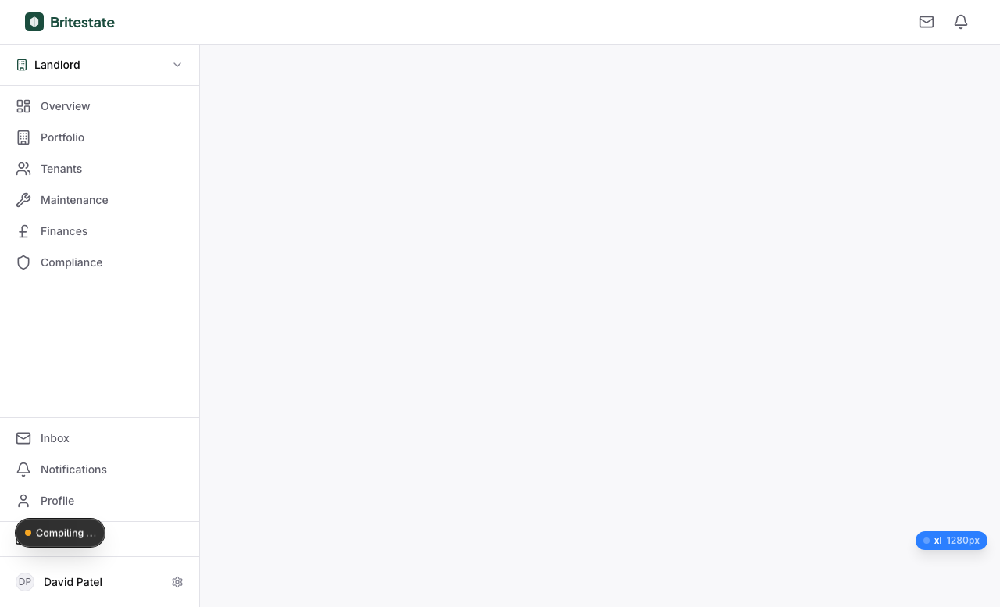

---

## Pages Successfully Tested (15/39)

| Page | Status | Screenshot |
|------|--------|------------|
| `/dashboard/landlord` | Working — good empty state | ll-01-dashboard.png |
| `/dashboard/landlord/properties` | Working — "No properties yet" empty state | ll-02-properties.png |
| `/dashboard/landlord/tenants` | Working — 5-stage pipeline, empty | ll-03-tenants.png |
| `/dashboard/landlord/rent` | Working — KPIs (all £0), tabs, empty state | ll-04-rent.png |
| `/dashboard/landlord/compliance` | Working — 4 cert tiles, calendar, empty state | ll-05-compliance.png |
| `/dashboard/landlord/maintenance` | Working — priority filters, empty state | ll-06-maintenance.png |
| `/dashboard/landlord/finance/expenses` | Working — table with filters, empty | ll-07-finance-expenses.png |
| `/dashboard/landlord/finance/report` | Working — charts section, Export CSV | ll-08-finance-report.png |
| `/dashboard/landlord/finance/tax` | Working — tax year dates, export buttons | ll-09-finance-tax.png |
| `/dashboard/landlord/analytics` | Working — KPIs, income trend chart | ll-10-analytics.png |
| `/dashboard/landlord/tools/yield-calculator` | Working — calculator with UK benchmarks | ll-11-yield-calc.png |
| `/dashboard/landlord/deposits` | Working — KPIs, empty state | ll-12-deposits.png |
| `/dashboard/landlord/find-agent` | Partial — skeleton loading, timed out | ll-14-find-agent.png |
| `/dashboard/landlord/find-tradespeople` | Partial — skeleton loading, structure good | ll-15-find-trades.png |
| `/dashboard/landlord/compliance-guide` | Working — comprehensive guide content | ll-16-compliance-guide.png |

## Pages with Issues (4/39)

| Page | Issue | Screenshot |
|------|-------|------------|
| `/dashboard/landlord/legal/notices` | Dead stub: "This feature is not available" | ll-13-legal-notices.png |
| `/dashboard/landlord/compliance/alerts` | Redirects to registration page | ll-17-compliance-alerts.png |
| `/dashboard/landlord/compliance/upload` | Blank white page | ll-18-compliance-upload.png |
| `/dashboard/landlord/insurance` | Redirects to login page | ll-20-insurance.png |

## Pages Not Tested (20/39)

These pages require dynamic route parameters (property IDs, application IDs, tenancy IDs) which can only be generated after creating properties and tenancies. The Add Property page timeout (ISSUE-003) blocked this testing path.

| Page | Reason |
|------|--------|
| `/dashboard/landlord/properties/add` | Timeout >15s |
| `/dashboard/landlord/properties/[id]` | Requires property ID |
| `/dashboard/landlord/properties/[id]/overview` | Requires property ID |
| `/dashboard/landlord/properties/[id]/documents` | Requires property ID |
| `/dashboard/landlord/properties/[id]/financials` | Requires property ID |
| `/dashboard/landlord/properties/[id]/listing` | Requires property ID |
| `/dashboard/landlord/properties/[id]/maintenance` | Requires property ID |
| `/dashboard/landlord/properties/[id]/maintenance/new` | Requires property ID |
| `/dashboard/landlord/properties/[id]/maintenance/[requestId]` | Requires IDs |
| `/dashboard/landlord/properties/[id]/tenancies` | Requires property ID |
| `/dashboard/landlord/properties/[id]/tenancies/[tenancyId]` | Requires IDs |
| `/dashboard/landlord/properties/[id]/tenancies/[tenancyId]/lease` | Requires IDs |
| `/dashboard/landlord/rent/[propertyId]` | Requires property ID |
| `/dashboard/landlord/tenants/[applicationId]` | Requires application ID |
| `/dashboard/landlord/tenants/[applicationId]/decision` | Requires application ID |
| `/dashboard/landlord/tenants/[applicationId]/tenancy/agreement` | Requires application ID |
| `/dashboard/landlord/maintenance/[id]` | Requires maintenance ID |
| `/dashboard/landlord/maintenance/[id]/assign` | Requires maintenance ID |
| `/dashboard/landlord/inventory/[propertyId]/check-in` | Requires property ID |
| `/dashboard/landlord/inventory/[propertyId]/check-out` | Requires property ID |

---

## Scenario Coverage Assessment

| Scenario | Testable? | Blocking Issues |
|----------|-----------|-----------------|
| S1: Accidental Landlord (Onboarding) | Blocked | ISSUE-003 (Add Property timeout), ISSUE-007 (Compliance Upload blank) |
| S2: Tenant Screener | Blocked | ISSUE-003 (need property to receive applications) |
| S3: Portfolio Commander | Partially testable | Dashboard KPIs work, but need multiple properties for meaningful test |
| S4: Emergency Responder | Blocked | ISSUE-003 (need property), mobile untested |
| S5: Compliance Warrior | Blocked | ISSUE-004 (Compliance Alerts redirect), ISSUE-007 (Upload blank) |
| S6: Eviction Navigator | Blocked | ISSUE-002 (Legal Notices stub) |
| S7: Overseas Landlord | Blocked | ISSUE-003 (need property for rent/maintenance) |
| S8: HMO Landlord | Blocked | ISSUE-003 (need property) |
| S9: Tax Season Landlord | Partially testable | Tax summary and finance pages work, but no data to export |
| S10: Growth Landlord | Blocked | ISSUE-003 (Add Property timeout) |

**Verdict: 0 of 10 scenarios are fully testable end-to-end.** The Add Property page timeout is the single biggest blocker — it prevents creating the data needed for nearly every other flow.

---

## Positive Findings

Despite the critical issues, the pages that do work show solid foundations:

1. **Empty states are well-designed** — Every working page has meaningful empty state messaging with helpful CTAs ("Add your first rental property", "No applications", "No rent entries found")
2. **Compliance Guide is excellent** — Comprehensive UK-specific content covering Gas Safety, EICR, EPC, Deposit Protection with links to external resources
3. **Tax Summary is well-structured** — Correct UK tax year dates, disclaimer, export options, per-property breakdown
4. **Tenant Pipeline is correct** — 5-stage Kanban (Received → Shortlisted → Referencing → Approved → Rejected) matches the application state machine
5. **Sidebar navigation is complete** — All 10 main sections accessible, user identity shown, icons appropriate
6. **Deposit Management has good KPIs** — Total Deposits Held, Registered, Pending, Disputed cards
7. **Find Tradespeople has excellent category filters** — Pre-built filter pills for Plumber, Electrician, Handyman, etc.
8. **Yield Calculator includes UK benchmarks** — 2025 UK average data for context

---

## Recommendations (Priority Order)

1. **Fix Add Property page timeout** — This unblocks 8 of 10 scenarios. Investigate server-side rendering, heavy imports, or blocking API calls.
2. **Fix nested button in LandlordSidebar** — The SheetTrigger/DialogTrigger composition needs refactoring. Quick fix: use `
` or `` as the inner element instead of `<button>`.
3. **Implement Legal Notices** — Replace stub with actual Section 8/21 notice generation. Components exist (`Section8NoticePDF`, `Section21NoticePDF`, `Section21PreflightChecklist`) but aren't wired up.
4. **Fix Compliance Alerts auth redirect** — Route may have incorrect middleware or missing auth check.
5. **Fix Compliance Upload rendering** — `ComplianceUploadForm` component exists but page doesn't render it.
6. **Fix Insurance page auth** — Route redirects to login despite active session.
7. **Investigate 400 resource errors** — Identify which API endpoints fail and fix Supabase RLS policies or query parameters.
8. **Add onboarding checklist** — First-run experience for new landlords (Scenario 1).
9. **Add UK tax year preset to Finance Report** — Quick win for Scenario 9.
10. **Fix Find Agent / Find Tradespeople loading** — Skeleton cards suggest data fetch failure or slow query.
