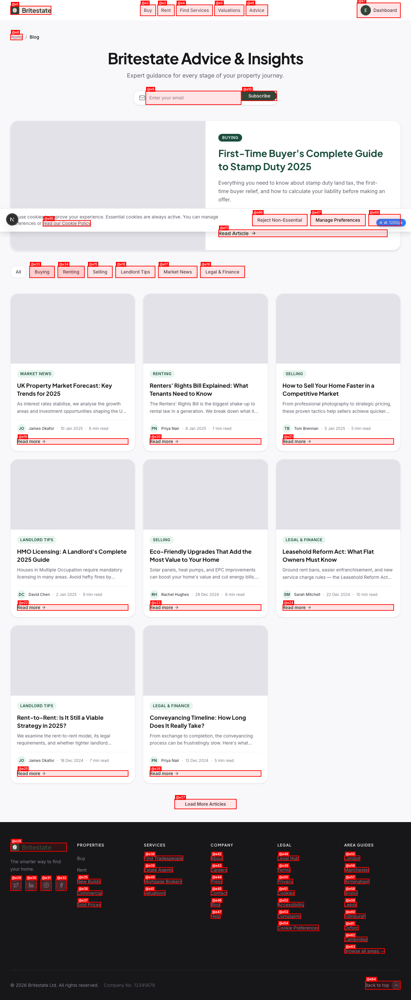
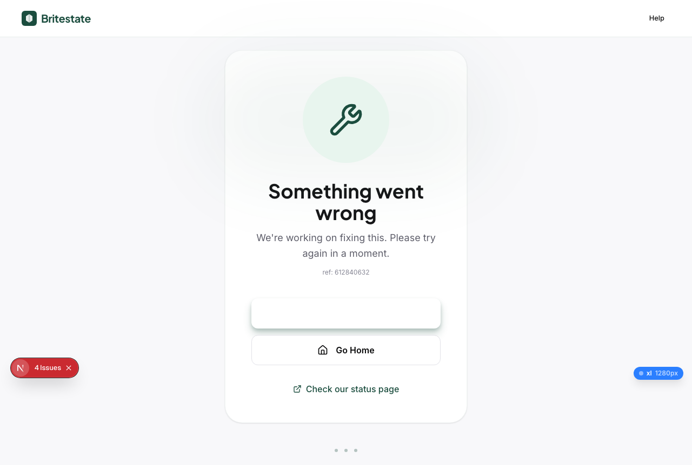
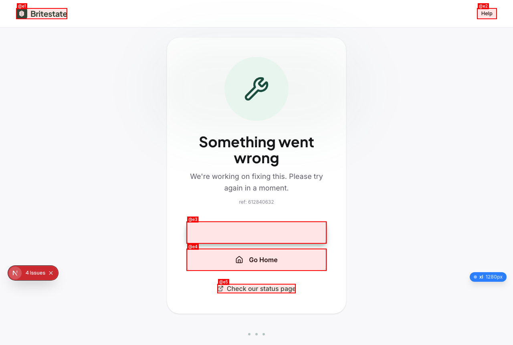
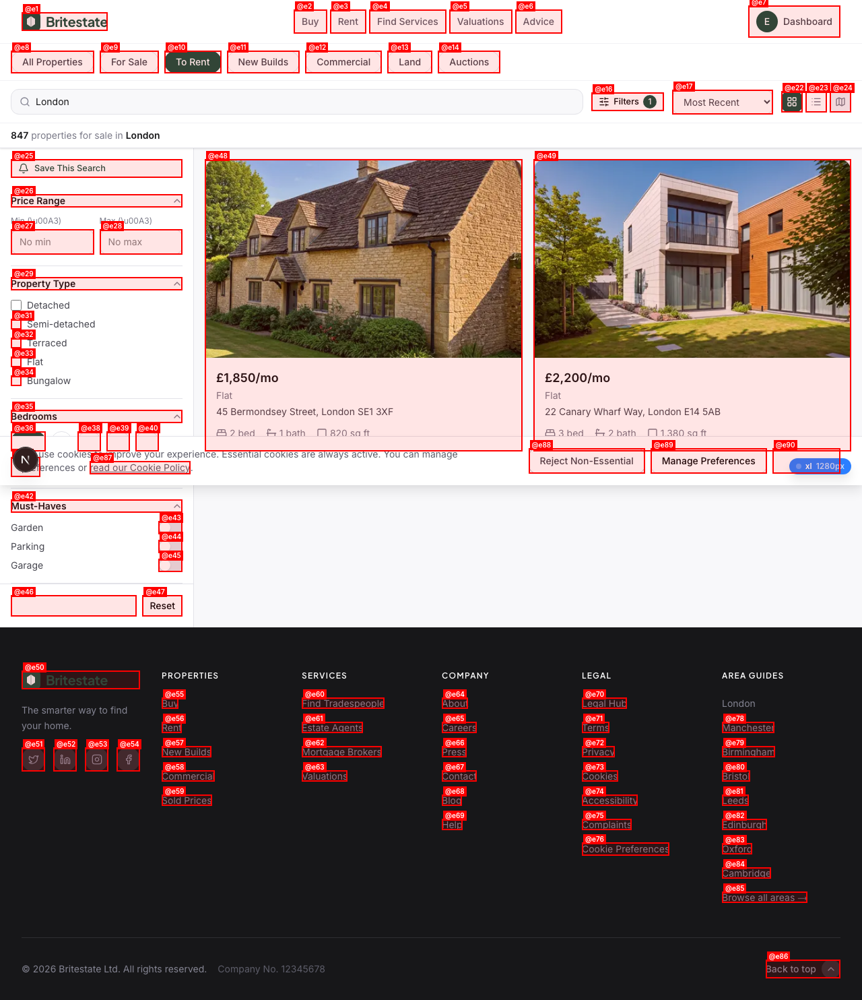
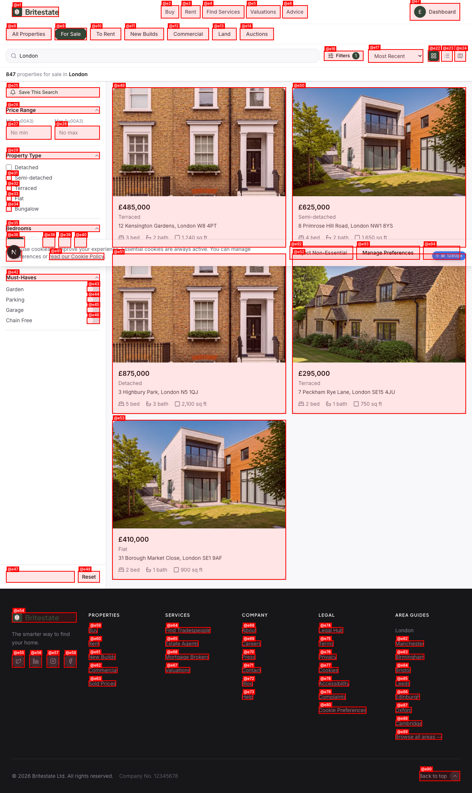
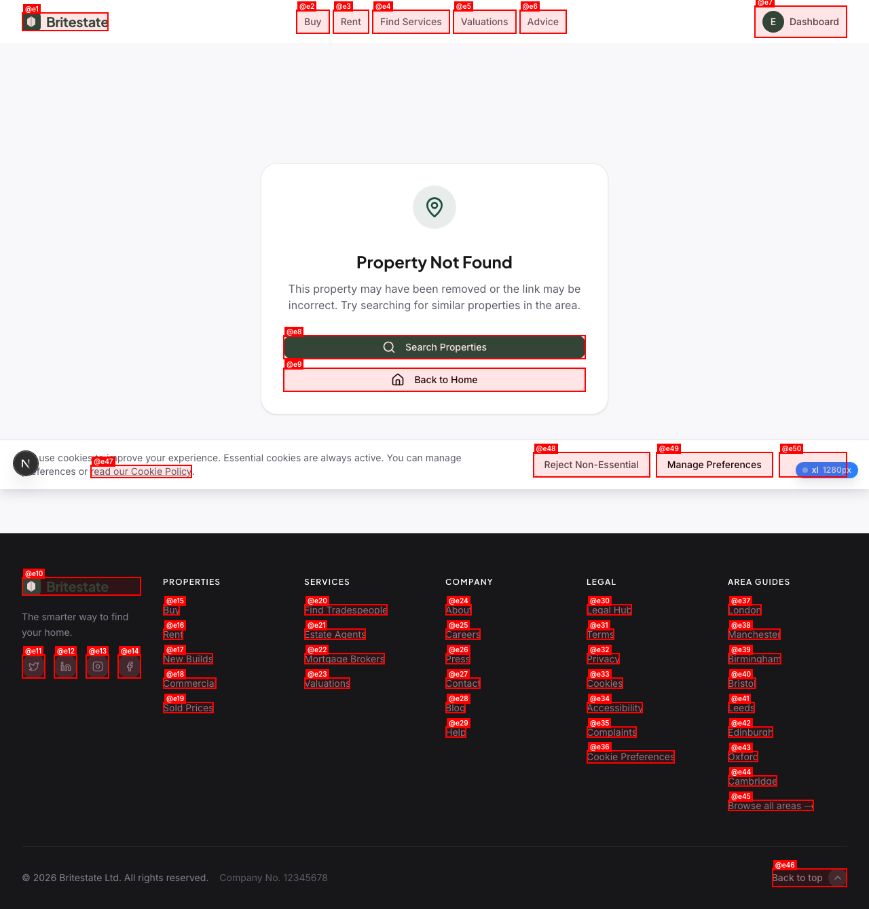
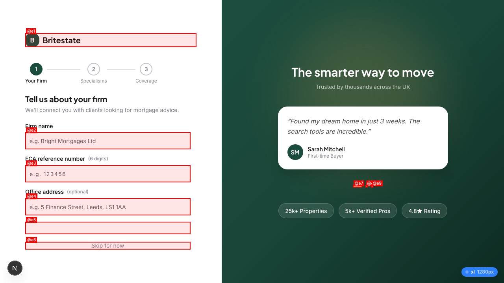
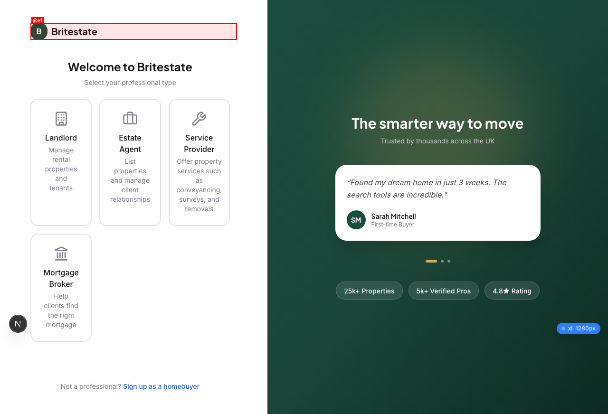

# QA Report: Britestate v3.0

| Field | Value |
|-------|-------|
| **Date** | 2026-03-19 |
| **URL** | http://localhost:3000 |
| **Scope** | Full app — guided by 20 Test User Flows (`docs/TEST-USER-FLOWS.md`) |
| **Mode** | Full |
| **Duration** | ~15 minutes |
| **Pages visited** | 22 |
| **Screenshots** | 24 |
| **Framework** | Next.js 16 (detected via `_next/data`, App Router) |

## Health Score: 42/100

| Category | Weight | Score |
|----------|--------|-------|
| Console | 15% | 40 |
| Links | 10% | 85 |
| Visual | 10% | 77 |
| Functional | 20% | 20 |
| UX | 15% | 35 |
| Performance | 10% | 70 |
| Content | 5% | 85 |
| Accessibility | 15% | 60 |

## Top 3 Things to Fix

1. **ISSUE-001: Middleware blocks public pages** — Blog, legal pages, valuation, and 404 all redirect to login. Users can't read Terms before signing up.
2. **ISSUE-002: Wrong dashboard for all roles** — Homebuyer sees Landlord sidebar; all role dashboards show identical billing page instead of role-specific content.
3. **ISSUE-003: Rent search shows buy listings** — `?type=rent` returns identical sale-price listings; no monthly pricing visible.

## Console Health

| Error | Count | First seen |
|-------|-------|------------|
| `<button>` nested inside `<button>` (hydration) | 2 | `/dashboard/landlord` |
| `asChild` prop not recognized on DOM element | 1 | `/dashboard/landlord` |
| Failed to load resource: 400 | 2 | `/dashboard/landlord` |
| Failed to load resource: 401 Unauthorized | 1 | `/search?type=buy` |
| `scroll-behavior: smooth` warning | 2 | Multiple pages |

## Summary

| Severity | Count |
|----------|-------|
| Critical | 3 |
| High | 3 |
| Medium | 3 |
| Low | 1 |
| **Total** | **10** |

## Issues

---

### ISSUE-001: Middleware over-blocks — public pages require login

| Field | Value |
|-------|-------|
| **Severity** | Critical |
| **Category** | Functional |
| **URL** | `/blog`, `/valuation`, `/legal/terms`, `/legal/privacy`, `/this-page-does-not-exist` |

**Description:** The middleware redirects ALL unknown routes to `/login?redirectTo=...`. This blocks pages that MUST be public: blog, valuation tool, legal/terms, legal/privacy, and proper 404 handling. Users cannot read Terms of Service or Privacy Policy before creating an account — a legal compliance issue.

**Affected pages confirmed:**
- `/blog` → redirects to `/login?redirectTo=%2Fblog`
- `/valuation` → redirects to `/login?redirectTo=%2Fvaluation`
- `/legal/terms` → redirects to `/login?redirectTo=%2Flegal%2Fterms`
- `/this-page-does-not-exist` → redirects to `/login?redirectTo=%2Fthis-page-does-not-exist` (should show 404)

**Pages that correctly stay public:** `/`, `/search`, `/services`, `/marketplace`, `/about`, `/help`

**Repro Steps:**

1. Open an incognito/logged-out browser
2. Navigate to `http://localhost:3000/blog`
3. **Observe:** Redirected to login page instead of blog content
   

**Impact:** Users cannot read blog content, legal pages, or get valuations without an account. Likely violates GDPR requirement to show privacy policy before signup.

---

### ISSUE-002: Role mismatch — all dashboards show Landlord sidebar + billing page

| Field | Value |
|-------|-------|
| **Severity** | Critical |
| **Category** | Functional |
| **URL** | `/dashboard/homebuyer`, `/dashboard/landlord`, `/dashboard/agent` |

**Description:** After logging in as Emma Thompson (homebuyer), the user is redirected to `/dashboard/landlord/billing/checkout/subscription` instead of `/dashboard/homebuyer`. ALL dashboard routes (`/homebuyer`, `/landlord`, `/agent`) show identical content: Landlord sidebar navigation (Portfolio, Tenants, Maintenance, Finances, Compliance) and a billing/subscription page as main content.

**Expected:** Each role should see their own dashboard:
- Homebuyer: Saved Properties, Searches, Viewings, Documents
- Landlord: Portfolio, Tenants, Maintenance, Finances, Compliance (correct sidebar, wrong main content)
- Agent: Listings, Leads, Viewings, Revenue, Team

**Repro Steps:**

1. Login as `emma.thompson@test.britestate.co.uk` / `Test1234!`
2. After login, check URL
3. **Observe:** Redirected to `/dashboard/landlord/billing/checkout/subscription`
   
4. Navigate to `/dashboard/homebuyer`
5. **Observe:** Still shows Landlord sidebar and billing page
   

**Root cause likely:** RoleSwitcher component hardcoded to "Landlord", or role detection from Supabase profile is returning wrong role/null.

---

### ISSUE-003: Rent search returns buy listings with sale prices

| Field | Value |
|-------|-------|
| **Severity** | Critical |
| **Category** | Functional |
| **URL** | `/search?type=rent` |

**Description:** Navigating to `/search?type=rent` shows the exact same property listings as `/search?type=buy` — same properties, same sale prices (£295,000–£1,125,000). No monthly rental pricing is shown. The "To Rent" tab is not visually active despite the URL parameter.

**Expected:** Rental search should show rental listings with monthly prices (e.g., £850/month), and the "To Rent" tab should be highlighted.

**Repro Steps:**

1. Navigate to `http://localhost:3000/search?type=rent`
2. **Observe:** Properties show sale prices (£485,000, £625,000, etc.), not monthly rent
   
3. Compare with `http://localhost:3000/search?type=buy` — identical results
   

---

### ISSUE-004: Property detail page shows "not found" for all properties

| Field | Value |
|-------|-------|
| **Severity** | High |
| **Category** | Functional |
| **URL** | `/properties/1`, `/properties/2`, etc. |

**Description:** Clicking a property from search results does not navigate to the property detail page. Direct navigation to `/properties/1` shows a minimal "Property not found" state with only "Search Properties" and "Back to Home" links — no images, price, description, features, map, mortgage calculator, or any property data.

**Expected:** Full property detail page with gallery, price, description, features, floor plans, EPC, local area info, mortgage calculator, SDLT calculator, and "Book Viewing" button (per Flow 1.6 in test doc).

**Repro Steps:**

1. Navigate to `http://localhost:3000/properties/1`
2. **Observe:** Page shows "Property not found" state
   

---

### ISSUE-005: Header shows "Sign In" when user is authenticated

| Field | Value |
|-------|-------|
| **Severity** | High |
| **Category** | UX |
| **URL** | `/search?type=buy`, all pages after login |

**Description:** After successful login (confirmed by access to dashboard pages), the header navigation still shows "Sign In" and "List Property" links instead of the user avatar, notifications bell, and authenticated state. The auth state is not reflected in the public header.

**Repro Steps:**

1. Login as Emma Thompson
2. Navigate to `/search?type=buy`
3. **Observe:** Header shows "Sign In" link despite being authenticated
   

---

### ISSUE-006: Broker and Provider onboarding redirect to login

| Field | Value |
|-------|-------|
| **Severity** | High |
| **Category** | Functional |
| **URL** | `/register/onboarding/broker`, `/register/onboarding/provider` |

**Description:** Broker and Provider onboarding pages redirect to the login page instead of showing the onboarding wizard. Homebuyer, Seller, Landlord, and Agent onboarding pages all work correctly.

**Expected:** Broker onboarding should show 3-step wizard (Firm → Specialisms → Coverage). Provider onboarding should show 4-step wizard (Trade → Coverage → Credentials → Availability).

**Repro Steps:**

1. Navigate to `http://localhost:3000/register/onboarding/broker`
2. **Observe:** Redirected to `/login?redirectTo=%2Fdashboard`
   

---

### ISSUE-007: Button-in-button hydration error in RoleSwitcher

| Field | Value |
|-------|-------|
| **Severity** | Medium |
| **Category** | Console |
| **URL** | All dashboard pages |

**Description:** React hydration error: `<button>` cannot be a descendant of `<button>`. The RoleSwitcher component wraps a Shadcn `Button` inside a `DropdownMenuTrigger` with `asChild={true}`, but both render as `<button>` elements, creating invalid HTML nesting. Additionally, the `asChild` prop leaks to the DOM element.

**Console errors:**
```
In HTML, <button> cannot be a descendant of <button>. This will cause a hydration error.
React does not recognize the `asChild` prop on a DOM element.
```

**Fix:** Use a `<div>` or `<span>` as the trigger child instead of `Button`, or ensure `asChild` properly prevents double-button rendering.

---

### ISSUE-008: All property images show "No image" placeholder

| Field | Value |
|-------|-------|
| **Severity** | Medium |
| **Category** | Visual |
| **URL** | `/search?type=buy` |

**Description:** All property cards in the search results grid show "No image" placeholder text. The homepage featured properties have images, but search result cards don't load any images.

**Repro Steps:**

1. Navigate to `/search?type=buy`
2. **Observe:** All 8 property cards show "No image" instead of property photos
   

---

### ISSUE-009: Missing "Seller" role in professional role-select

| Field | Value |
|-------|-------|
| **Severity** | Medium |
| **Category** | Functional |
| **URL** | `/register/role-select` |

**Description:** The role-select page shows 4 professional roles (Landlord, Estate Agent, Service Provider, Mortgage Broker) but does not include "Seller" as an option. Per Flow 20.1, users like Raj should be able to select both "Landlord" and "Seller" simultaneously for multi-role accounts.

**Note:** Sellers can register via the homepage "List Property" CTA or via the registration form's intent toggle, but there's no way to select Seller as a professional role alongside another role.

**Repro Steps:**

1. Navigate to `/register/role-select`
2. **Observe:** Only 4 roles available, no "Seller" card
   

---

### ISSUE-010: Search property cards not navigable — click does nothing

| Field | Value |
|-------|-------|
| **Severity** | Low |
| **Category** | Functional |
| **URL** | `/search?type=buy` |

**Description:** Clicking a property card in search results does not navigate to the property detail page. The card is rendered as a link but the click doesn't trigger navigation. May be related to event handling or the link target being invalid.

**Repro Steps:**

1. Navigate to `/search?type=buy`
2. Click on the first property card ("12 Kensington Gardens")
3. **Observe:** URL remains `/search?type=buy`, no navigation occurs

---

## Pages Tested (22 total)

| Page | Status | Notes |
|------|--------|-------|
| `/` (Homepage) | Pass | Clean, responsive, no errors |
| `/login` | Pass | Form works, Google OAuth button present |
| `/register` (via Sign Up) | Pass | Intent toggle, form fields correct |
| `/register/role-select` | Pass | 4 roles, missing Seller |
| `/forgot-password` | Pass | Form present, back to login link |
| `/verify-email` | Pass | Resend button, change email link |
| `/search?type=buy` | Partial | Results load but images missing, cards not clickable |
| `/search?type=rent` | Fail | Shows buy listings |
| `/search` (Map view) | Pass | MapLibre loads, filters work |
| `/properties/1` | Fail | Shows "not found" |
| `/services` | Pass | Categories listed, links work |
| `/marketplace` | Pass | Trade categories, search bar |
| `/blog` | Fail | Redirects to login |
| `/valuation` | Fail | Redirects to login |
| `/about` | Pass | Accessible |
| `/help` | Pass | Accessible |
| `/legal/terms` | Fail | Redirects to login |
| `/dashboard/homebuyer` | Fail | Wrong role, billing page |
| `/dashboard/landlord` | Fail | Shows billing page as content |
| `/dashboard/agent` | Fail | Wrong sidebar, billing page |
| `/register/onboarding/homebuyer` | Pass | 4-step wizard works |
| `/register/onboarding/landlord` | Pass | Wizard works |
| `/register/onboarding/seller` | Pass | Wizard works |
| `/register/onboarding/agent` | Pass | Wizard works |
| `/register/onboarding/broker` | Fail | Redirects to login |
| `/register/onboarding/provider` | Fail | Redirects to login |

## Mobile Responsiveness

| Page | Mobile (375x812) | Notes |
|------|-----------------|-------|
| Homepage | Pass | Hamburger menu, cards stack, no overflow |
| Search | Pass | List layout, bottom action bar (Map/Filters/Sort) |

## What Works Well

- **Homepage** is polished with featured properties, service categories, blog preview, and city links
- **Onboarding wizards** (homebuyer, seller, landlord, agent) are well-built with proper step progression, back navigation, skip option, and disabled Continue until valid
- **Search filters** are comprehensive with property type, bedrooms, must-haves, sort, and view toggles
- **Map view** integrates MapLibre properly with zoom, satellite, fullscreen
- **Mobile responsiveness** is solid on homepage and search
- **Marketplace/Services** pages provide good discovery for professional services
- **Cookie consent banner** is present and functional
