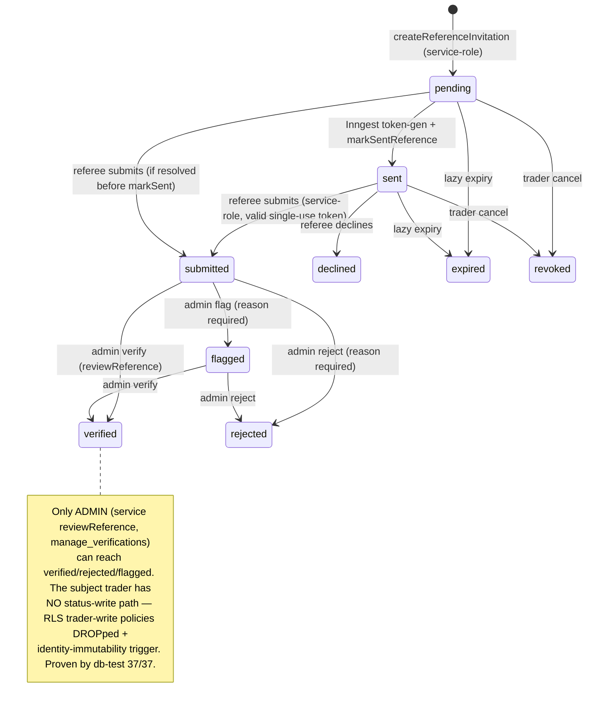

# Vouching State Machine — Post-Fix (Current = Implemented)

**Branch:** `feat/vouching-system` · **Date:** 2026-07-12 (post-fix update)

The pre-fix "RECOMMENDED / TARGET" model is now **largely the implemented CURRENT model**. This document describes what the code + DB now enforce. Items still not built (account-linking, background expiry sweep) are called out as REMAINING.

> **CONFIRMED vs UNTESTED-LIVE.** The DB-layer rules below (enum, RLS, immutability, uniqueness, single-use) are **CONFIRMED** by `db-tests/provider-references-vouching.test.ts` (37/37, real Postgres) and unit tests. The end-to-end transitions across the browser are **UNTESTED-LIVE** until the migrations are applied to the target DB (see `VOUCHING_SYSTEM_AUDIT.md §17`).

---

## 1. Trader / Provider Verification Status

### 1.1 CURRENT (enforced)

Enum `provider_verification_status` = `unverified | pending_review | verified | suspended | rejected`
(`supabase/migrations/002_marketplace.sql:54-60`).

```mermaid
stateDiagram-v2
    [*] --> unverified: provider row created (default)
    unverified --> pending_review: provider submits (admin queue populates)
    pending_review --> verified: admin approves (gate-aware: confirm if gate ON && counts unmet)
    pending_review --> rejected: admin rejects
    verified --> suspended: (enum allows; no code path yet)
    rejected --> pending_review: (enum allows; no code path yet)
```



**New (post-fix): a configurable, default-OFF vouch gate feeds the approve decision.** When `verification_vouch_rules.gate_enabled = TRUE`, the admin approve UI requires confirmation if the provider has not met ≥ N peer + ≥ M recent-customer **valid (verified)** vouches. With the gate OFF (the default), the existing direct-approve flow is unchanged. Counting is `countValidVouches` (verified-only, client recency window); the decision is the pure `evaluateVouchGate`.

| State | Entry cause | Who changes it | Public sees |
|-------|-------------|----------------|-------------|
| `unverified` | default | system | no badge |
| `pending_review` | provider submits (`getVerificationQueue`) | provider/system | no badge |
| `verified` | admin approve (gate-aware) | verification admin | ShieldCheck (`ProviderSearchCard.tsx`) |
| `rejected` | admin reject | verification admin | no badge |
| `suspended` | no code path yet | — | — |

---

## 2. Invitation Lifecycle (now a first-class entity)

### 2.1 CURRENT (enforced)

The invitation is the `provider_references` row plus its **token columns** (`invite_token_hash` [sha256 hex, raw never stored], `invite_expires_at`, `invite_sent_at`, `invite_last_sent_at`, `invite_send_count`) added by `20260712100002_vouching_provider_references_columns_rls.sql:18-31`. The raw token is single-use and expiring; only its hash lives in the DB.

```mermaid
stateDiagram-v2
    [*] --> pending: createReferenceInvitation (service-role; self-vouch/dup/cap guarded)
    pending --> sent: Inngest generates+hashes token, markSentReference, email dispatched
    sent --> submitted: referee submits (service-role, single-use token)
    sent --> declined: referee declines
    pending --> expired: invite_expires_at passed (lazy on resolve)
    sent --> expired: invite_expires_at passed (lazy on resolve)
    pending --> revoked: trader cancels
    sent --> revoked: trader cancels
    sent --> sent: trader resends (cooldown + max-sends; new token)
```

Enforcement:
- **Single-use:** submit/decline set `invite_token_hash = NULL` and filter `.not("invite_token_hash","is",null)`, so a replay matches 0 rows (`reference-submission-service.ts:183,196,245,248`).
- **Uniqueness:** one live token per hash (`uq_provider_references_token_hash`); one ACTIVE invite per (provider, lower(email), type) for statuses in `pending|sent|submitted|flagged` (`20260712100002:62-69`).
- **Expiry:** lazy on resolve (`reference-submission-service.ts:107-116`); expiry-sweep index exists (`:72-73`).
- **Cooldown / caps:** resend cooldown from `verification_vouch_rules.resend_cooldown_hours`; per-provider active cap `MAX_ACTIVE_INVITES=25`; max-sends on resend.

### 2.2 REMAINING (not yet built)

- A **background Inngest expiry sweep** (expiry is currently lazy-on-resolve only).
- An explicit `opened`/`resent` sub-state (resend re-uses `sent`).

---

## 3. Individual Vouch / Reference Status

### 3.1 CURRENT (enforced) — 9 statuses

Enum `provider_reference_status` = `pending | sent | submitted | verified | declined | expired | revoked | rejected | flagged`
(base 3 in `20260316100001:25`; +6 in `20260712100001_vouching_reference_status_values.sql:14-19`).



| State | Entry cause (legit) | Who sets it | Permitted next | Audit |
|-------|--------------------|-------------|----------------|-------|
| `pending` | `createReferenceInvitation` (service-role) | service (trader-initiated) | sent / expired / revoked | — |
| `sent` | Inngest `markSentReference` | service (Inngest) | submitted / declined / expired / revoked / (resend→sent) | — |
| `submitted` | referee `submitReference` (single-use token) | referee via service-role | verified / rejected / flagged | — |
| `declined` | referee `declineReference` | referee via service-role | terminal | — |
| `expired` | lazy expiry on resolve | service | terminal | — |
| `revoked` | trader `cancelReferenceInvitation` | service (trader) | terminal | — |
| `verified` | admin `reviewReference` verify | verification admin | (flagged→verify possible) | `admin_audit_log.metadata {decision,reason}` |
| `rejected` | admin reject (reason req) | verification admin | terminal | audit metadata |
| `flagged` | admin flag (reason req) | verification admin | verified / rejected | audit metadata |

**The pre-fix bug is closed:** the subject trader can no longer move a vouch to `verified` (or any status). RLS DROPs trader insert/update/delete-own; a BEFORE UPDATE trigger freezes `provider_id`/`referee_email`/`reference_type` for **all** paths (admin and service-role). Proven by `db-tests/provider-references-vouching.test.ts` (37/37).

**Audit:** admin review writes an `admin_audit_log` entry with `metadata:{decision,reason}` (`review/route.ts:60-74`). Referee/trader lifecycle transitions do not currently emit per-transition audit rows (REMAINING — see remediation R13).

### 3.2 REMAINING (not yet built)

- `duplicate` / `withdrawn` as distinct terminal states (duplicates are blocked pre-insert by the unique index; trader cancel uses `revoked`).
- `under_review` intermediate (admin acts directly on `submitted`/`flagged`).
- `revoked` post-approval fraud path (revoke currently applies to outstanding invites).
- Per-transition audit events for non-admin lifecycle changes (R13).
- Automated fraud/self-vouch heuristics auto-flagging on submit (R10).

---

## 4. Summary of the Gap (post-fix)

| Dimension | Pre-fix Current | Post-fix Current | Remaining |
|-----------|-----------------|------------------|-----------|
| Reference states | 3 (`pending/submitted/verified`) | **9** (pending…flagged) | duplicate/withdrawn/under_review niceties |
| Legit writers of non-`pending` | none (only INSECURE trader UPDATE / seed) | **referee (submit) + admin (verify/reject/flag), service-role mediated; trader writes REMOVED** | — |
| Invitation entity | none (collapsed into reference) | **tokenised (sha256), expiring, single-use, cancellable, resend-cooldown** | background expiry sweep |
| Provider gate | admin sets `verified` directly; references optional | **configurable count-gate (default OFF) via `verification_vouch_rules`; gate-aware approve** | live enablement (product decision) |
| Audit | none per-reference; decision omitted from admin metadata | **admin review writes `metadata:{decision,reason}`** | per-transition events for lifecycle (R13) |
| Forge protection | INSECURE (trader could self-verify) | **RLS trader-write DROPped + identity trigger; proven db-test 37/37** | — |
