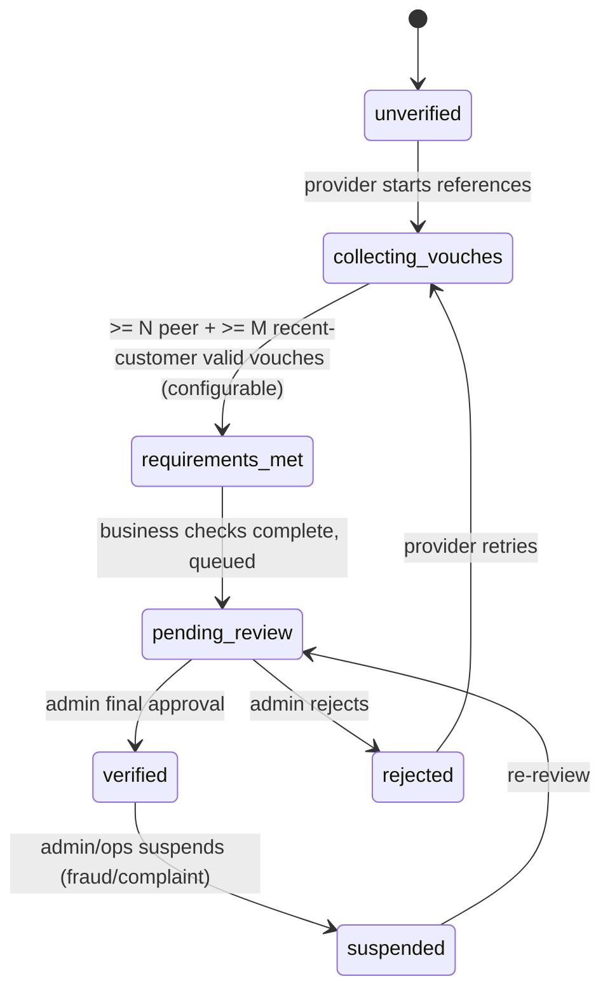
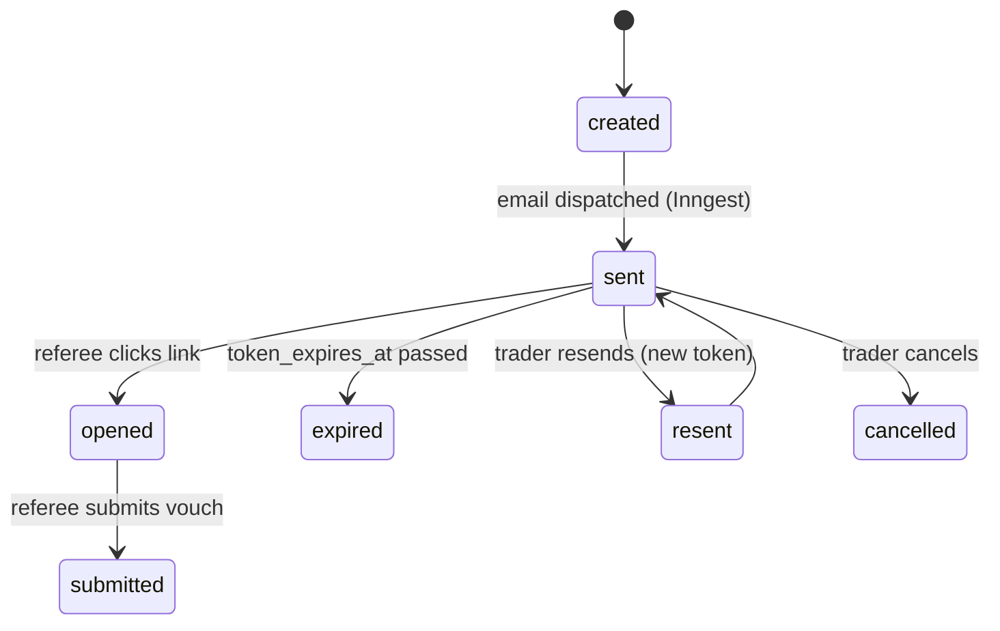
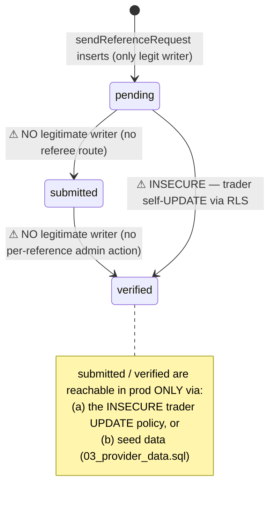
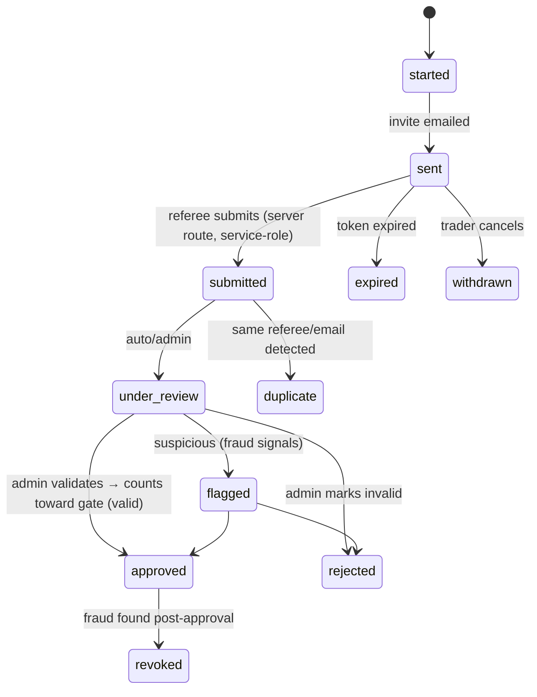

# Vouching State Machine — Current vs Recommended

**Branch:** `feat/vouching-system` · **Date:** 2026-07-12

This document separates **CURRENT** (what the code and DB enforce today) from **RECOMMENDED / TARGET** (the richer model from the product brief). Nothing in the RECOMMENDED sections is implemented on this branch.

---

## 1. Trader / Provider Verification Status

### 1.1 CURRENT (enforced)

Enum `provider_verification_status` = `unverified | pending_review | verified | suspended | rejected`
(`supabase/migrations/002_marketplace.sql:54-60`; column added `:92-94`, default `unverified`).

```mermaid
stateDiagram-v2
    [*] --> unverified: provider row created (default)
    unverified --> pending_review: provider submits docs (admin queue populates)
    pending_review --> verified: admin approves (decision 'approved')
    pending_review --> rejected: admin rejects (decision 'rejected')
    verified --> suspended: (enum allows; no code path found)
    rejected --> pending_review: (enum allows; no code path found)
```

| State | Entry cause | Who changes it | Permitted next (by code) | Audit event | Trader sees | Admin sees | Public sees |
|-------|-------------|----------------|--------------------------|-------------|-------------|------------|-------------|
| `unverified` | default on provider creation (`002:92-94`) | system | → `pending_review` | — | dashboard verification gate (`proxy.ts:425-430`) | not in queue | no badge |
| `pending_review` | provider submits (populates queue via `getVerificationQueue` `verification-service.ts:24`) | provider/system | → `verified` / `rejected` | none for entry | "under review" | queue row | no badge |
| `verified` | admin `approved` → `verified` (`verification-service.ts:57-59`) | verification admin | (no guarded transition) | `verification.review` action logged, **decision omitted from metadata** (`audited-admin-action.ts:98-107`) | full dashboard access + badge | — | ShieldCheck (`ProviderSearchCard.tsx:44`), anon RLS (`017_public_profiles.sql:48-54`) |
| `rejected` | admin `rejected` (`:57-59`) | verification admin | (none) | as above | rejection (outcome email `:77-84`) | — | no badge |
| `suspended` | **no code path writes it** | — | — | — | — | — | — |

**Prohibited / ungoverned transitions:** the code applies *no* transition guard — `reviewVerification` unconditionally sets `verified` or `rejected` regardless of current state (`verification-service.ts:57-64`). `suspended` is defined but unreachable.

### 1.2 RECOMMENDED / TARGET

Richer lifecycle adding an explicit vouching phase and a configurable, default-OFF gate:

Gate defaults **OFF** (existing direct admin-approval flow preserved) until turned on per config.

---

## 2. Invitation Status

### 2.1 CURRENT (enforced)

**There is no invitation entity.** An invitation is implicitly the same row as the reference (`provider_references`), and there is no token, no expiry, no single-use, and no `cancelled` state (table def `20260316100001:126-139`). The only lifecycle action is a hard `DELETE` via `provider_references_delete_own` (`:177-183`). So "invitation status" collapses entirely into the reference status below.

### 2.2 RECOMMENDED / TARGET

A first-class invitation with a signed, single-use, expiring token:

New columns needed: `invite_token`, `token_expires_at`, `consumed_at`, plus states in a status enum. Audit each transition.

---

## 3. Individual Vouch / Reference Status

### 3.1 CURRENT (enforced)

Enum `provider_reference_status` = `pending | submitted | verified`
(`supabase/migrations/20260316100001_provider_dashboard_tables.sql:25`; default `pending` `:134`).

| State | Entry cause (legit) | Who *can* change it today | Permitted next (code) | Audit event | Trader sees | Referee sees | Admin sees |
|-------|--------------------|---------------------------|-----------------------|-------------|-------------|-------------|------------|
| `pending` | `sendReferenceRequest` INSERT (`provider-verification-service.ts:334`) | trader (insert) | none via app; trader UPDATE (INSECURE) | none | "Pending" badge + dead "Send Request" btn (`ReferenceTracker.tsx:58-63,174-182`) | nothing (no email) | not surfaced per-reference |
| `submitted` | **none** — no referee submission route exists | only trader UPDATE (INSECURE `:164-175`) / seed | none via app | none | "Submitted" badge + "Remind"/"View" (`:50-56,183-201`) | — | not surfaced per-reference |
| `verified` | **none** — no per-reference admin action | only trader UPDATE (INSECURE) / seed | terminal | none | "Verified" badge + `verified_at` (`:42-49,159-168`) | — | not surfaced per-reference |

**Prohibited-but-actually-possible transition (the bug):** `pending → verified` by the *trader themselves* via `provider_references_update_own` (`:164-175`). This should be impossible for the subject of the vouch; it is the CRITICAL finding V-01.

**No audit-log events** are emitted for any reference status change (grep: no `logAdminAction`/audit call in `provider-verification-service.ts`).

### 3.2 RECOMMENDED / TARGET

A full referee-driven lifecycle with validity and moderation states:

`started → sent → submitted → under_review → approved (valid) | rejected (invalid) | flagged`
plus `duplicate`, `withdrawn`, `revoked`, `expired`.

| Recommended state | Actor who sets it | Counts toward gate? | Audit event |
|-------------------|-------------------|---------------------|-------------|
| `started` / `sent` | trader / system | no | `reference.invited` |
| `submitted` | referee (via tokenised server route) | pending | `reference.submitted` |
| `under_review` | system/admin | no | `reference.review_started` |
| `approved` (valid) | verification admin | **yes** | `reference.approved` |
| `rejected` (invalid) | verification admin | no | `reference.rejected` |
| `flagged` | admin/fraud signal | no | `reference.flagged` |
| `duplicate` | system | no | `reference.duplicate` |
| `withdrawn` | trader | no | `reference.withdrawn` |
| `revoked` | admin/ops | removes credit | `reference.revoked` |
| `expired` | system (Inngest sweep) | no | `reference.expired` |

Key rules for the target model:
1. The **subject trader can never move a vouch to a valid/approved state** — that write must be service-role + admin-only.
2. Only `approved` (valid), from a `submitted` referee via a verified token, counts toward the configurable requirement.
3. Every transition writes an audit-log event with `metadata` (reference id, actor, decision).

---

## 4. Summary of the Gap

| Dimension | Current | Target |
|-----------|---------|--------|
| Reference states | 3 (`pending/submitted/verified`) | ~11 (started…revoked) |
| Legit writers of non-`pending` | **none** (only INSECURE trader UPDATE / seed) | referee (submit) + admin (approve/reject/flag), service-role mediated |
| Invitation entity | none (collapsed into reference) | tokenised, expiring, single-use, cancellable |
| Provider gate | admin sets `verified` directly; references optional | configurable count-gate (default OFF) feeds `pending_review` |
| Audit | none per-reference; decision omitted from admin metadata | event per transition with metadata |
